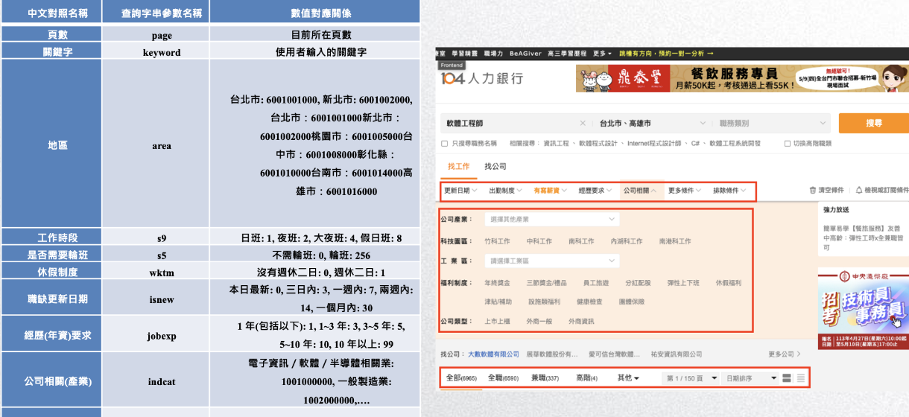
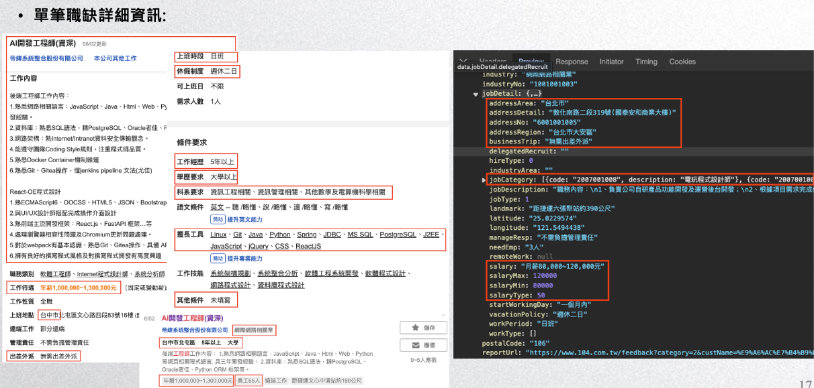
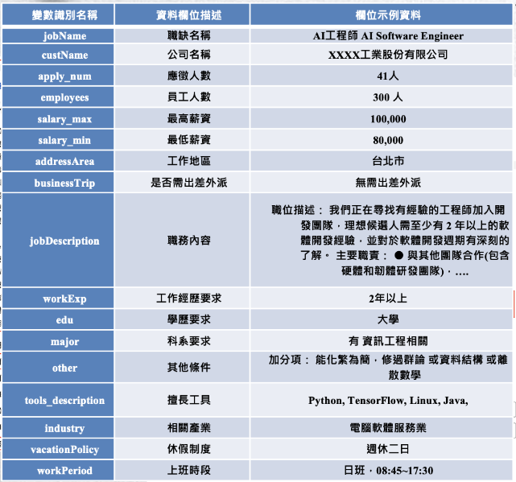

# 104 Job Bank Software Engineer Data Analysis Project

This project performs comprehensive data scraping, preprocessing, and statistical analysis of software engineer job postings from the 104 Job Bank platform, utilizing linear mixed-effects models to explore key factors affecting salary.

## Project Overview




### Research Objectives

- Analyze the current state of Taiwan's software engineer job market
- Explore salary influencing factors and regional differences
- Provide data insights for job seekers and enterprises

### Key Features

- **Large-scale Data Collection**: Automated scraping of 2000+ job postings
- **Multi-dimensional Analysis**: Covers salary, skills, location, industry aspects
- **Advanced Statistical Models**: Linear mixed-effects models for salary determinant analysis
- **Chinese Text Analysis**: Integration of Jieba word segmentation and TF-IDF analysis

## Project Structure

```
104-data-analysis/
├── 104_crawl.py                    # Main web scraping script
├── 104_data.json                   # Raw JSON data
├── 104_data.xlsx                   # Processed Excel data
├── 104_data_filtered.xlsx          # Filtered analysis data
├── descriptive_statistics.ipynb    # Descriptive statistical analysis
├── encode_job_data.ipynb          # Data encoding and preprocessing
├── Jieba.ipynb                     # Chinese text analysis
├── Linear Mixed Effects Models.ipynb # Linear mixed-effects model analysis
├── ckiptagger.ipynb               # Chinese word segmentation analysis
├── filtered_sentences.txt         # Filtered text sentences
├── stop_words.txt                 # Chinese stopwords list
└── README.md                      # Project documentation
```

## Core Features

### 1. Data Scraping (104_crawl.py)

#### Main Functions

- **Intelligent Crawler System**: Efficient scraping based on requests and JSON API
- **Anti-crawling Mechanism**: Random delays (3-5 seconds) to avoid blocking
- **Data Integrity**: Automatic retrieval of detailed and basic job information
- **Flexible Filtering**: Multi-dimensional filtering support for salary, location, experience

#### Core Class: Job104Spider

```python
class Job104Spider():
    def search(self, keyword, max_mun=10, filter_params=None, sort_type='relevance')
    def get_job(self, job_id)
    def search_job_transform(self, job_data)
    def convert_salary_to_mothly(self, salary_min, salary_max)
```

#### Data Fields

Collects the following key information:






- **Basic Info**: Job title, company name, update date
- **Salary Info**: Max/min salary (unified conversion to monthly salary)
- **Position Requirements**: Education, experience, skills, department requirements
- **Work Conditions**: Location, business trip requirements, company size
- **Descriptive Info**: Job content, other conditions, industry category

### 2. Data Preprocessing and Encoding (encode_job_data.ipynb)

#### Data Cleaning

- **Salary Standardization**: Unified conversion of annual and hourly wages to monthly
- **Outlier Handling**: Filter invalid data with salary 0 or 9,999,999
- **Missing Value Imputation**: Use mean values for text readability indicators

#### Feature Engineering

- **Salary Range Encoding**: Divide salary into 9 ranges based on government statistics
- **Education Hierarchy**: No requirement(1) → High school(1) → College(2) → Bachelor(3) → Master(4) → PhD(5)
- **Regional Grouping**: North(1), Central(2), South(3), East(4), Others(5)
- **Industry Classification**: Leisure services(1), Business services(2), High-tech manufacturing(3)

#### Text Analysis Indicators

- **Readability Assessment**: Calculate Flesch readability scores using Textatistic
- **Subjectivity Analysis**: Assess text subjectivity based on TextBlob sentiment analysis

### 3. Descriptive Statistical Analysis (descriptive_statistics.ipynb)

#### Salary Distribution Analysis

```
Salary Range Distribution:
- 39K~45.5K: 21.86% (largest group)
- 45.5K~54.5K: 21.47%
- 54.5K~62.1K: 13.09%
- 122K+: 2.51% (high-salary group)
```

#### Skills Demand Analysis

Analysis of most popular technologies by salary range:

- **Low-medium salary ranges**: Primarily JavaScript, C#, HTML, CSS
- **High salary ranges**: Increased demand for Python, Linux, AWS, Go

#### Industry Distribution

- **High-tech Manufacturing & ICT**: 95.21% (dominant position)
- **Leisure & Human Services**: 2.46%
- **Business Services & Wholesale**: 2.33%

### 4. Chinese Text Analysis (Jieba.ipynb)

#### TF-IDF Keyword Analysis

- **Job Content Analysis**: Identify key technologies and responsibilities in job descriptions
- **Stopword Filtering**: Use custom Chinese-English stopword lists
- **Technology Trend Identification**: Analyze technology frequency across salary ranges

### 5. Linear Mixed-Effects Model Analysis (Linear Mixed Effects Models.ipynb)

#### Model Design

Using work location as random effect, analyzing individual-level variables' impact on salary:

```python
formula = ("salary ~ education_code + experience_code + company_size + "
           "related_major_required + industry_category + job_content_readability + "
           "job_content_subjectivity + other_conditions_readability + other_conditions_subjectivity + "
           "(1 | work_location_code)")
```

#### Key Findings

- **Work Experience**: Each experience level increase adds average 9,880 TWD
- **Education Requirement**: Each education level increase adds average 4,698 TWD
- **Job Content Subjectivity**: High subjectivity jobs average 15,147 TWD higher
- **Other Conditions Subjectivity**: High subjectivity jobs average 26,689 TWD higher

## Technical Architecture

### Core Tech Stack

- **Data Scraping**: Python requests, JSON API
- **Data Processing**: pandas, numpy
- **Statistical Analysis**: statsmodels (linear mixed-effects models)
- **Text Analysis**: jieba (Chinese word segmentation), TextBlob, Textatistic
- **Data Visualization**: Based on Jupyter Notebook

### Development Environment

```
Python 3.8+
pandas >= 1.3.0
requests >= 2.25.0
statsmodels >= 0.12.0
jieba >= 0.42.0
textblob >= 0.15.0
textatistic >= 0.0.1
```

## Installation and Usage

### Environment Setup

```bash
# Install dependencies
pip install pandas requests statsmodels jieba textblob textatistic openpyxl

# Download NLTK resources (required for TextBlob)
python -c "import nltk; nltk.download('punkt'); nltk.download('brown')"
```

### Running the Scraper

```python
from Job104Spider import Job104Spider

# Initialize scraper
spider = Job104Spider()

# Set filter conditions
filter_params = {
    'sr': 99,  # Has salary information
    # Other filter conditions...
}

# Execute search
total_count, jobs = spider.search('software engineer', max_mun=9999, filter_params=filter_params)
```

### Data Analysis Workflow

1. **Run Scraper**: Execute `104_crawl.py` to get latest data
2. **Data Preprocessing**: Run `encode_job_data.ipynb` for feature engineering
3. **Descriptive Analysis**: Run `descriptive_statistics.ipynb` for basic statistics
4. **Text Analysis**: Execute `Jieba.ipynb` for keyword analysis
5. **Model Analysis**: Run `Linear Mixed Effects Models.ipynb` to build predictive models

## Key Findings and Insights

### Salary Influencing Factor Rankings

1. **Work Experience** (coefficient: 9,880) - Most important factor
2. **Education Requirement** (coefficient: 4,698) - Traditional important indicator
3. **Job Description Subjectivity** (coefficient: 15,147/26,689) - Newly discovered important factor

### Technology Trend Insights

- **Frontend Technologies**: Stable demand for JavaScript, HTML, CSS
- **Backend Trends**: Rising demand for Python, Go, Node.js
- **Cloud Technologies**: Clear demand for AWS, Docker in high-salary positions

### Regional Differences

- Regional effects are relatively small, showing Taiwan's software industry salary convergence
- Individual-level factors are more important than regional factors

## Project Features

### Academic Value

- **Innovative Methodology**: First to incorporate text subjectivity into salary analysis models
- **Big Data Application**: Supported by 2000+ real market data points
- **Cross-disciplinary Integration**: Combines statistics, NLP, and economics

### Practical Value

- **Job Seeking Reference**: Provides skill development direction and salary expectations
- **Enterprise Decision Making**: Assists HR in setting reasonable salary levels
- **Policy Making**: Provides data support for labor policies

## Future Development

### Expansion Directions

- **Real-time Monitoring**: Establish periodic update mechanisms to track market changes
- **Multi-platform Integration**: Include data from other job banks
- **Predictive Models**: Develop salary prediction and career planning tools
- **Visualization Dashboard**: Build interactive data presentation interfaces

### Technical Optimization

- **Crawler Performance**: Implement distributed crawling and incremental updates
- **Model Improvement**: Try deep learning and ensemble learning methods
- **Text Enhancement**: Integrate BERT and other pre-trained models

## License and Citation

This project is licensed under the MIT open source license. Please cite appropriately if using this project's data or methods.

## Contact Information

For questions or collaboration opportunities, please contact the project maintainer.

---

_This project is dedicated to understanding Taiwan's software engineer job market through data science methods, providing valuable insights for job seekers, enterprises, and policymakers._
